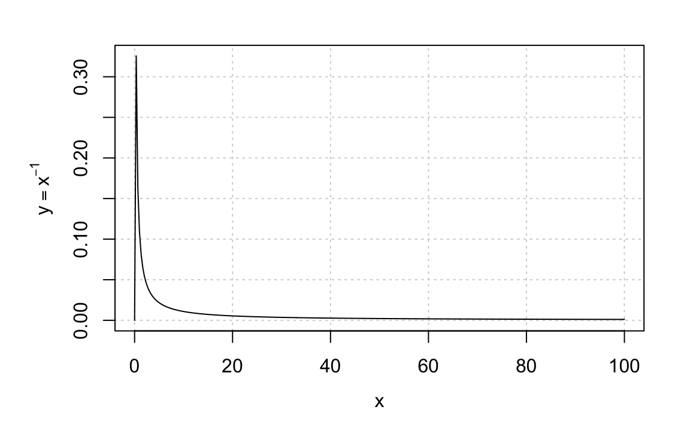

<style type="text/css">  
/* Note: CSS uses C-style commenting. */
h1.title{font-size:22px; text-align:center;}
h4.author{font-size:16px; text-align:center;}
h4.date{font-size:16px; text-align:center;}
body{ /* Normal  */ font-size: 13px}
td {  /* Table   */ font-size: 12px}
h1 { /* Header 1 */ font-size: 16px}
h2 { /* Header 2 */ font-size: 14px}
h3 { /* Header 3 */ font-size: 12px}
.math{ font-size: 10pt;}
.hi{ /* hanging indents */ 
    padding-left:22px; 
    text-indent:-22px;
}
blockquote {  
    padding: 10px 20px;
    margin: 0 0 20px;
    font-size: 12px;
    border-left: 5px solid #eee;
}
code.r{ /* code */ 
       font-size: 12px;
}
pre{/*preformatted text*/ 
    font-size: 12px;
}
p.caption {/* figure captions */ 
    font-size: 0.9em;
    font-style: italic; 
} 
</style>

```{r setup, echo=FALSE}
rm(list=ls()) # clean up
library(knitr)
gr <- (1+sqrt(5))/2 # golden ratio, for figures
## Set default chunk options
opts_chunk$set(comment="  ",
               #collapse=TRUE, 
               #echo=FALSE,
               fig.asp=1/gr,
               dev="png",
               fig.width=6,
               out.width="80%",
               fig.align="center"
               )
``` 

# Introduction {-}  
This assignment is based very roughly on Chapter 3 of our text, but it will also give you a bit of practice making, exporting, and importing figures.  

# Reminders {-}    

- Don't forget to immediately:  
  * save-as this file to `(your surname)_A3.Rmd`;  
  * change the title field in the YAML headers to `(your surname)_A3`; and    
  * change the author field to `(your name)`.  
- If you have not already done so, please download the folder of software `DBDA2Eprograms` that goes with our text. You can get it [here](https://sites.google.com/site/doingbayesiandataanalysis/software-installation) by clicking the first downward-pointing blue arrow at the bottom of the page.    
- If you cannot find the error in a code chunk, put `eval=FALSE` in the chunk header, so it doesn't crash the knit, and go on to the next exercise.   
- Help each other, but don't copy.  

# Exercise 3.0  
(not in text, 10 points) List the technical terms you encountered in this chapter, with a '?' after those you have not encountered before. Look up at least one of the terms that are new to you---Wikipedia is always a good place to begin---and give a definition that makes sense to you.  

# Solution 3.0  

The technical terms I noticed are: script, sourcing, working directory, precedence, logical operator, relational operator, class, component-by-component (sometimes called element-by-element), categorical data (R uses the shorter word factor), levels, recoding, matrix, array, row, column, layer, predictors (explanatory variables), collapsing, *snakeback* notation, *camelBack* notation, *goose_neck* notation, *ant.notation*. (I often have trouble remembering the last four terms.)   

Chao gave some useful definitions here:  

- [help.start()](http://127.0.0.1:26867/doc/html/index.html) is a command to show you the introduction manuals or documents of R.  

- [rep()](https://www.rdocumentation.org/packages/base/versions/3.6.2/topics/rep) is a function used to create vectors with repeating elements. Don't confuse it with `replicate()` which is used for repeated evaluation of an expression (usually involving random number generation).  

- [write.csv()](https://stat.ethz.ch/R-manual/R-devel/library/utils/html/write.stable.html) is an R utility function used to write data to disk in comma separated values (CSV) format. The easiest and most helpful treatment I have seen is [Grolemund](https://rstudio-education.github.io/hopr/dataio.html). The help entry for `write.table()` isn't nearly as helpful as Grolemund, but it gives us some useful terminology when it tells us that `write.csv()` and `write.csv2()` provide _convenience wrappers_ [of `write.table()`] for writing CSV files.  

- [aggregate()](https://www.rdocumentation.org/packages/stats/versions/3.6.2/topics/aggregate) is a utility function used to summarize data.  


# Exercise 3.01  
(not in text, 10 pts)  If you don't have a research project yet, just say "I don't have a research project yet." Otherwise, describe your research problem in $\le$ 100 words answering the following questions: What are the data? What are the predictors (sometimes referred to as covariates or explanatory variables)? Which of them are inherently positive quantities? What statistical distribution(s) do you think describe your observation errors?  

# Solution 3.01   
(Put your narrative here.)  

# Exercise 3.1  
(not in text, 10 pts) Create a function in R that converts Fahrenheit temperatures to Celsius temperatures. Use your function to make a plot with Fahrenheit on the x-axis and Centigrade on the y-axis. Use `xlim=c(-50, 120)`. **Hints:** Recall the formula $C = (F - 32)\cdot 5/9$. Use `xlab=expression(degree*F)` and `ylab=expression(degree*C)` in your `plot()` call. 

# Solution 3.1a  

```{r ex3.1a, fig.cap="**Figure 3.1.** Temperature conversion of Fahrenheit to Centigrade."}
Cent <- function(F) (F - 32)*5/9
F <- seq(-60, 130, length.out=71)
C <- Cent(F)
plot(F, C, type="l",
     panel.first=grid(),
     xlab=expression(degree*F),
     ylab=expression(degree*C)
     )
```  

# Exercise 3.2a  
(A take-off Ex 3.2 on 70 of our text, 10 pts) Create a chunk that makes a figure in your html and ALSO saves it to a separate file in the same folder as your Rmd. For your figure, make a graph of the function 

$$
p(x) = 
\begin{cases}
  (xC)^{-1} & \mathrm{if\ \ } \epsilon \le x \le 1/\epsilon \\
  0 & \mathrm{otherwise}
\end{cases} \tag{1}
$$  

on the interval $[0,\epsilon^{-1}]$. Give your function the name `recip` with arguments `x` and `eps`. In your function definition give `eps` the default value 0.01, and use that value for your plot. Use `integrate()` to check that your function has unit integral. In your plot call use `ylab=expression(y==x^{-1})`. Use the `fig.cap` chunk option to give your figure the caption "**Figure 3.2a.** The truncated-reciprocal probability density function." Be sure to use the chunk label ex3.2a or the instructions below for Ex 3.2(b) and (c) will not work.       

**Hints:** To save a figure separately when using R Markdown, put `fig.path="fig-"` in the chunk header. The portable network graphics (png) format is best for html, but you may also want to save the figure as a pdf. If so, put `dev=c("png", "pdf")` in the chunk header. You will then get nice looking html as well as a saved pdf of your figure. If you want to save it as an encapsulated postscript file use `dev=c("png", "eps")`. If you wanted to save all your figures this way, you would make those chunk options default values in the setup chunk.      

# Solution 3.2a  
Here is the requested plot. I give two versions of `recip()`. The first version is preferred for its clarity, but the second version is succinct. The help entry for `ifelse()` states that ifelse(test, yes, no) returns a value with the same shape as test which is filled with elements selected from either yes or no depending on whether the element of test is TRUE or FALSE.

```{r ex3.2a, fig.path = "fig-", fig.cap="**Figure 3.2(a).** The truncated-reciprocal probability density function."}

recip <- function(x, eps=0.01) {
  C <- 2*log(1/eps)
  tf <- x >= eps & x <= 1/eps
  x[ tf] <- 1/x[tf]/C
  x[!tf] <- 0
  return(x)
}

## Alternative version using ifelse()
recip <- function(x, eps=0.01) {
  C <- 2*log(1/eps)
  tf <- x >= eps & x <= 1/eps
  ifelse(tf, 1/x/C, 0)
}

## Check for unit integral
# integrate(recip, lower=0, upper=101) 

eps <- 0.01
x <- seq(from=0, to=1/eps, length.out=301)
y <- recip(x)
par(mar=c(4.1, 5, 2, 2), mgp=c(2.5, 1, 0)) # cosmetic
plot(x, y, type="l", 
     panel.first=grid(), 
     ylab=expression(y==x^{-1})
     )
```  

# Exercise 3.2b  
(5 pts) Read in the png image that you saved, and plot it again by putting `knitr::include_graphics("fig-ex3.2a-1.png")` in a chunk. Use the `fig.cap` chunk option to give your figure the caption "**Figure 3.2b.** Here for a second time is the plot I made in Ex 3.2a." 

# Solution 3.2b  
```{r ex3.2b, fig.cap="**Figure 3.2(b).** Here for a second time is the plot I made in Ex 3.2a."}

```  

# Exercise 3.2c  
(5 pts) Read in the png image that you made in Ex 3.2a and plot it again using the Markdown syntax ``. Give your figure the caption "**Figure 3.2(c).** Here for the third time is the plot I made in Ex 3.2a."   

# Solution 3.2c  
The Markdown syntax for images is easy to use, but compared to `include_graphics()` it gives little control over the size and alignment of the image. Here I use raw html `<center>...</center>` to center the image and caption. 
<center>
   
_**Figure 3.2(c).** Here for a third time is the plot I made in Ex 3.2a._
</center>

# Exercise 3.3  
(a take-off on the trivial Ex 3.3, page 70 of our text, 10 points) The [beta PDF](https://en.wikipedia.org/wiki/Beta_distribution) has the simple kernel $\theta^{(\alpha-1)}(1-\theta)^{(\beta-1)}$, and is widely used in statistics because (jargon alert!) it is an easy prior for probabilities and proportions, and because it is a natural conjugate prior for the binomial and Bernoulli sampling distributions. It deserves to be much better known in the physical sciences because it is easily scaled and stretched to be a prior for whatever quantity you want. Plot the beta PDF with shape parameters $\alpha=\beta=4$. **Hints:** Use the R-supplied `dbeta()` with 301 points. Use the names `a` and `b` for the shape parameters. For your x-label use `expression(theta)` and for your y-label use  
`bquote(p[Theta](theta~"|"~alpha==.(a)~","~beta==.(b)))`.  

The functions `expression()` and `bquote()` return _language objects_ that graphics devices know how to print. The `bquote()` function evaluates whatever is wrapped in `.()`        

# Solution 3.3  

Some books have their figures in boxes. To see what that looks like, I put a box around this figure using `box()`. 

```{r ex3.3, fig.asp=0.5, out.width="95%", fig.cap="**Figure 3.3.** The beta distribution is surprisingly useful, not least because it can be stretched and scaled to make a finite-domain distribution that readers of your research papers will like."}
par(mar=c(4.1, 5, 2, 2), mgp=c(2.5, 1, 0)) # cosmetic
x <- seq(from=0, to=1, length.out=301)
a <- 4
b <- 4
y <- dbeta(x, a, b)
plot(x, y, type="l", bty="l", xaxs="i", yaxs="i",
     panel.first=grid(),
     xlab=expression(theta), 
     ylab=bquote(p[Theta](theta~"|"~alpha==.(a)~","~beta==.(b)))
    )
box("figure", col="gray")

```

# Exercise 3.4  
(not in text, 5 points) Copy the file `HGN.csv` from Kruschke's `DBDA2Eprograms` folder into your ERTH695 folder. Then read HGN.csv with the statement `hgn <- read.csv("HGN.csv")`. Make a data frame `hgn1` from `hgn` by moving columns `Name` and `Group` to positions 1 and 2.  Display `hgn1` using `kable()` which is in the `knitr` package. Use the `align` argument of `kable()` to space the columns nicely. Use the `caption` argument of `kable()` to give your table the caption "**Table 3.5.** Kruschke's HGN dataset with the Name and Group columns first."      

# Solution 3.4  

There are dozens of ways to rearrange the columns.      
```{r ex3.4}
hgn <- read.csv("HGN.csv")
# show(hgn) # check
hgn1 <- hgn[c(4,5,1:3)]
# hgn1 <- hgn[ , c(4,5,1:3)]
# hgn1 <- hgn[c("Name", "Group", "Hair", "Gender", "Number")]
# hgn1 <- hgn[ , c("Name", "Group", "Hair", "Gender", "Number")]
# and so forth...
kable(hgn1, align="lcccc", caption="**Table 3.5.** Kruschke's HGN dataset with the Name and Group columns first.")
```   


# Exercise 3.5  
(not in our text, 10 points) Use inline code where possible to:  

a. Display the first three rows of the data frame `hgn` (or `hgn1`) using bracket notation with row numbers.  
b. Display the first three rows using the `head()` function.  
c. What are the type and class of the `Hair` component? Hint: Use the functions `typeof()` and `class()`. What are the levels of the `Hair` component? Hint: Use the `levels()` function.   
d. Change the group component to a factor, using the `factor()` function, and display the result with its levels.  
e. Display the Hair component by referring to it three different ways: using brackets with column number, using brackets with column name, and using the selection operator `$`. The selection operator is an example of [syntactic sugar](https://en.wikipedia.org/wiki/Syntactic_sugar).  

# Solution 3.5  

a. Using `hgn[1:3, ]` the first three rows of the HGN dataset are 
```{r ex3.4a} 
hgn[1:3, ]
```  
b. Using `head(hgn, 3)` the first three rows are 
```{r ex3.4b} 
head(hgn, 3)
```  
c. The type of the `Hair` component is `r typeof(hgn$Hair)`.  
   The class of the `Hair` component is `r class(hgn$Hair)`.  
   The levels of the `Hair` component are `r levels(hgn$Hair)`.  
d. The result of changing `Group` to a factor is `r factor(hgn$Group)`. The levels are `r levels(factor(hgn$Group))[1]` and `r levels(factor(hgn$Group))[2]`.    
e. Using `hgn[ ,1]` the `Hair` component is  
       `r hgn[ ,1]`.  
   Using `hgn[ ,"Hair"]` the `Hair` component is  
        `r hgn[ ,"Hair"]`.  
   Using `hgn$Hair` the `Hair` component is  
        `r hgn$Hair`.  

# Exercise 3.6  
(not in text, 5 points) If `X` and `Y` are matrices then `t(X)` gives a transpose and `X %*% Y` is the usual matrix multiplication you may be used to from Matlab. In R, vectors aren't row or column vectors as in Matlab; they are just vectors. Use `x <- 1:3` and `y <- 2:4` to illustrate (a) that `x*y` gives you element-by-element multiplication, (b) ` x %*% y` gives you an inner product and (c) `x %o% y` gives you an outer product, i.e., the matrix you would get if `x` were a column and `y` were a row.  

# Solution 3.6  
```{r ex3.6a}
x <- 1:3
y <- 2:4
cat("(a) x*y is ", x*y, "\n\n")
cat("(b) x %*% y is ", x %*% y, "\n\n")
cat("(c) x %o% y is...\n\n")
x %o% y
```  

## Remarks  
- If you go to the packages tab in RStudio and type "Matrix" in the search window you will find a number of special packages for matrix calculations. The **matlib** package was written especially for teaching and learning matrix algebra.   
- Matrices in R can have row names and column names if you want. The main difference between a matrix and a data frame is that the matrix elements must be all be the same type, usually but not necessarily numbers.   
- Most of the time when you want to make a matrix you use the `matrix()` function. However it is sometimes handy to know that you can make a vector into a matrix or array just by changing its `dim` attribute, as in the following example. Note that the matrix is filled column by column and the array is filled layer by layer. The layer number is the third index.  

```{r ex3.6b}
x <- 1:6 
class(x)
x # a vector
dim(x) <- c(2, 3) # 2 rows, 3 columns
class(x) # matrix
x
x <- 1:12 
x # vector
dim(x) <- c(2, 3, 2)
class(x) # array
x
```


# Et cetera  
(If you have a question, or a suggestion for class, tell me here.)

